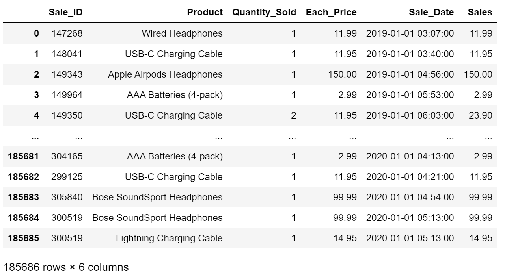
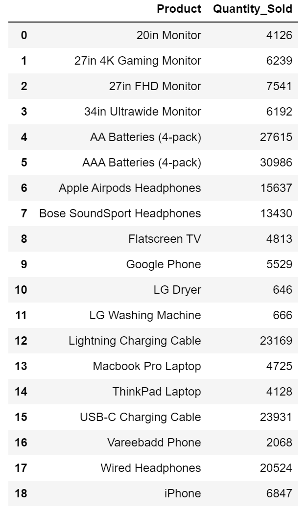
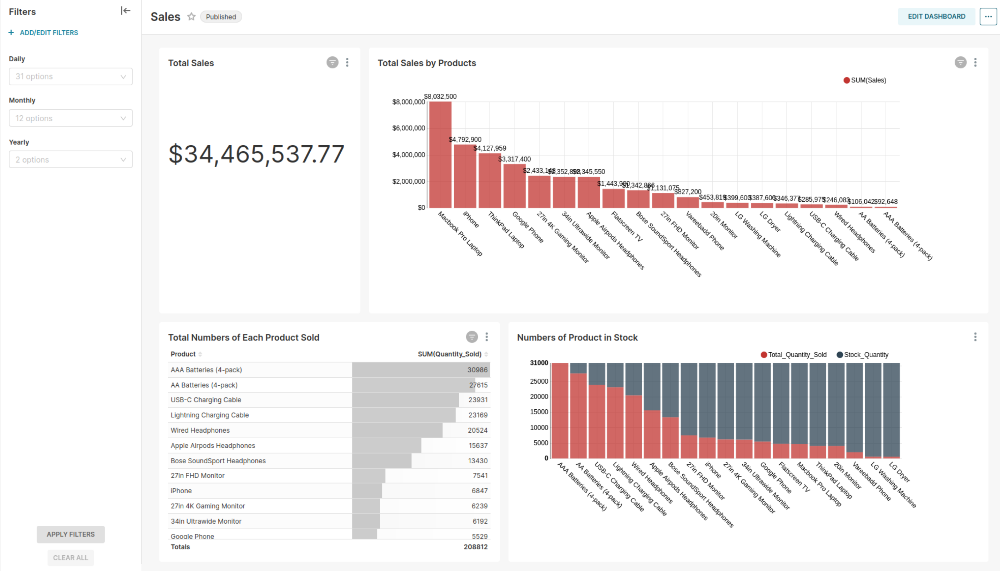

# Real-Time Data Analysis

## What and Why I am building this project?

I am building a real-time sales data analysis Application using Spark Structured Streaming, Kafka as messaging system, MongoDB as a raw data storage for backup and analytic purposes using machine learning, MySQL as a storage for processed data and Superset for creating dashboard.

The goal of this project is to find out whether having a real-time sales data analysis application will be a solution to solve the problems facing at Mya Gon Yaung, Men’s traditional clothing retail shop where I am working at.

## Problem facing at the shop

The shop manually records everything in a book and didn’t use digital recording. Since sales are only written in a book, it is easy to find daily sales but difficult to know monthly or yearly sales. So, we don’t know our monthly and yearly sales, what products are sold most in which month and which stocks needs to be refill and which don’t?  As we don’t know the answers to these questions, we often over stock or under stock many products which greatly affect our profits.

## Task:

Find out if I can get answers to these questions using a real-time data analysis system:
*	What is monthly and yearly sales?
*	Which products produce highest sales?
*	What products produce highest sales in which month?
*	Which stocks are low?
*	What stocks to refill in which month?

To see having a real-time data analysis or Point of Sales (POS) System will be helpful for the business or not?

## Data Platform Architecture

This is the data platform architecture that I have created for this project. When customers make purchases at checkout counter, the sales information data are passed to Kafka producer and send them to Kafka topic. When the data come to Kafka topic in the messaging layer, those data are ingested and processed using Apache Spark streaming application. The raw data are stored in MongoDB and processed data are then stored in MySQL database. The stored data in MySQL are pulled and build live dashboard using Apache Superset.

## Data Source

Since I don’t have data from the shop and a front-end application to mimic checking out products, I find similar type of [sales dataset](https://www.kaggle.com/datasets/knightbearr/sales-product-data) on Kaggle and directly use those dataset in Kafka Producer instead.

## Data Preparation

As it is not the actual data from the shop but from Kaggle, the data need to be clean and remove some unnecessary columns which is no need for my use case. The detail process of preparing data can be seen in Data_Preparation.ipynb. After cleaning the data, I have got two datasets. One is for sales data (Processed_Data.csv) and another dataset is stock quantity data (Stock_Quantity.csv) created base on sales data.

Sample of Sales Data

Stock Quantity Data 

## Data Producer

Writing a Kafka Producer (sales_data_producer.py) to stream sales data (Processed_Data.csv) to “sales_topic” topic in Kafka server.

## Data Storage

Writing a python script (create_database_tables_mysql.py) to create database and tables in MySQL to store processed data.

## Spark Structure Streaming

Writing a python script (structure_streaming.py) to ingest, process and store data from “sales_topic” Kafka topic into MongoDB and MySQL.

In this script, a spark session read stream data from Kafka topic as a stream dataframe. From this stream dataframe, sales data is extracted and store this raw sales data into MongoDB. 

The extracted sales data is transformed by splitting Sale_Date column into Date, Day, Month and Year Columns. The Sale_Date column is then dropped as the time (hours, minutes, seconds) that the sale happen is not important for my use case but Day, Month and Year are as they are needed for daily, monthly and yearly sales. This transformed data is stored into sales table in MySQL.

Read the Stock Quantity data (Stock_Quantity.csv) from local device and then the extracted sales data is transformed by dropping Sale_ID, Each_Price, Sale_Date and Sales columns for joining with Stock Quantity data.

The Stock Quantity data and transformed sales data are inner join on Product column. Joint data is then group by Product and Stock_Quantity columns. The column Quantity_Sold in grouped data is aggregated by summing and renamed the column as Total_Quantity_Sold. The aggregated data is then store into stocks table in MySQL.

## Dashboard

Created a dashboard in Apache Superset using data from sales and stocks tables in MySQL.

