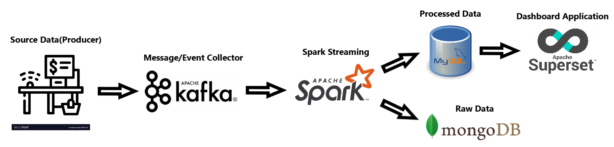

# Real-Time Data Analysis

## What and Why I am building this project?

I am building a real-time sales data analysis Application using Spark Structured Streaming, Kafka as messaging system, MongoDB as a raw data storage for backup and analytic purposes using machine learning, MySQL as a storage for processed data and Superset for creating dashboard.

The goal of this project is to find out whether having a real-time sales data analysis application will be a solution to solve the problems facing at Mya Gon Yaung, Men’s traditional clothing retail shop where I am working at.

## Problem facing at the shop

The shop manually records everything in a book and didn’t use digital recording. Since sales are only written in a book, it is easy to find daily sales but difficult to know monthly or yearly sales. So, we don’t know our monthly and yearly sales, what products are sold most in which month and which stocks needs to be refill and which don’t?  As we don’t know the answers to these questions, we often over stock or under stock many products which greatly affect our profits.

## Task:

Find out if I can get answers to these questions using a real-time data analysis system:
*	What is monthly and yearly sales?
*	Which products produce highest sales?
*	What products produce highest sales in which month?
*	Which stocks are low?
*	What stocks to refill in which month?

To see having a real-time data analysis or Point of Sales (POS) System will be helpful for the business or not?

## Data Platform Architecture

This is the data platform architecture that I have created for this project. When customers make purchases at checkout counter, the sales information data are passed to Kafka producer and send them to Kafka topic. When the data come to Kafka topic in the messaging layer, those data are ingested and processed using Apache Spark streaming application. The raw data are stored in MongoDB and processed data are then stored in MySQL database. The stored data in MySQL are pulled and build live dashboard using Apache Superset.

## Data Source

Since I don’t have data from the shop and a front-end application to mimic checking out products, I find similar type of [sales dataset](https://www.kaggle.com/datasets/knightbearr/sales-product-data) on Kaggle and directly use those dataset in Kafka Producer instead.
